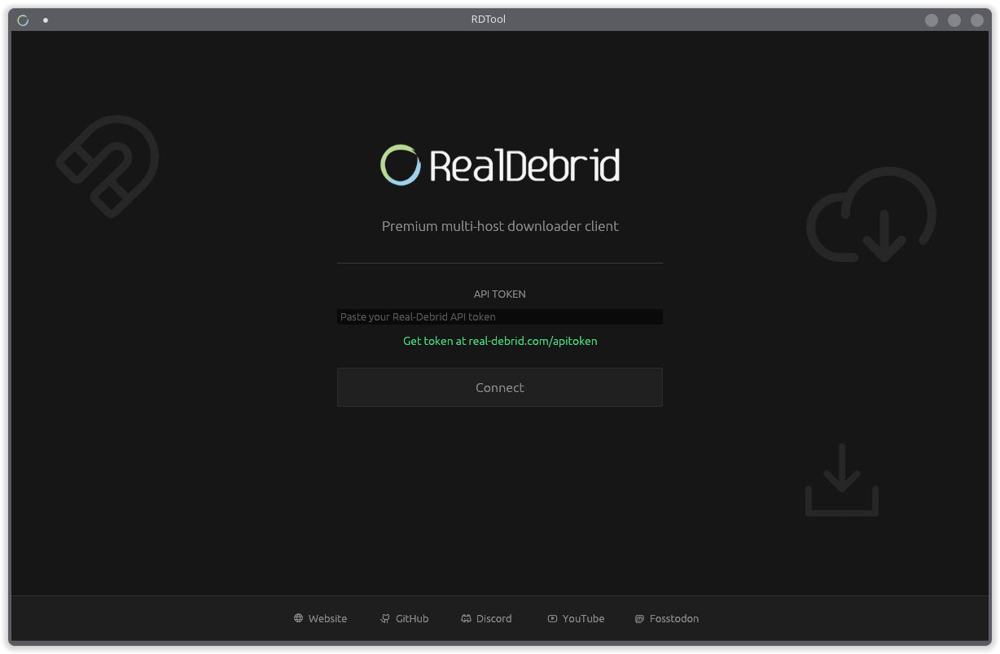

# RDTool

[](https://github.com/DarkXero-dev/RDTool/actions/workflows/build.yml)
[](LICENSE)
[](https://github.com/DarkXero-dev/RDTool/releases/latest)

A native desktop GUI client for [Real-Debrid](https://real-debrid.com). Converts restricted hosted links and magnets into fast direct downloads. Built entirely in Rust with egui - no web wrapper, no Electron.

---



---

## Features

- Unrestrict links from 35+ supported hosters instantly
- Add magnet links or `.torrent` files, grab generated direct links
- Built-in multi-threaded download manager with persistent queue and scheduler
- Export unrestricted links to `.txt` for external download managers
- System tray support - close to tray, restore from tray icon
- API token encrypted at rest with AES-256-GCM

## Install

Grab the latest build from the [Releases](https://github.com/DarkXero-dev/RDTool/releases/latest) page.

| Platform | Package |
|----------|---------|
| Arch Linux | `PKGBUILD` (build from source) |
| Debian / Ubuntu | `.deb` |
| Fedora / RHEL | `.rpm` |
| Windows | `.exe` (NSIS installer) |
| macOS | `.dmg` |

## Build from Source (Arch Linux)

**Dependencies:**

```
sudo pacman -S rust gtk3 openssl xdotool libayatana-appindicator sqlite wayland
```

**Build and install:**

```bash
git clone https://github.com/DarkXero-dev/RDTool.git
cd RDTool
makepkg -rsf
sudo pacman -U rdtool-*.pkg.tar.zst
```

## Getting Your API Token

1. Log in to [real-debrid.com](https://real-debrid.com)
2. Go to [real-debrid.com/apitoken](https://real-debrid.com/apitoken)
3. Copy your token and paste it into RDTool on first launch

## License

[MIT](LICENSE) - Copyright (c) 2026 DarkXero-dev
